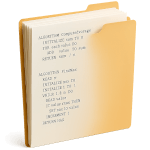

esto es un primer borrador hecho con un modelo de IA, disculpen el cringe, cuando quede medianamente arreglado se quitará la advertencia

  

<h1 align="center">Soluciones AED – Guía de Trabajos Prácticos</h1>

Nombre: Juan Pérez

Comisión: Z

Año de cursado: 2069

Este repositorio es una **plantilla no oficial** pensada para que cada estudiante pueda subir sus propias soluciones a los ejercicios de la [Guía de Trabajos Prácticos](https://aed-frre.github.io/) de la materia *Algoritmos y Estructuras de Datos (AED)*.

* 📁 Tiene una estructura pre-armada con los ejercicios de la guía (2025).
* 🫂 Cada fork (especie de copia) que hagas vos u otros estarán disponibles para que los compares fácilmente.
* 🕦 Apuntes de alumnos de años anteriores son también bienvenidos.
* 🍀 Ojalá esto tenga algo de tracción.

 

## 🔎 ¿Cómo ver soluciones de otros compañeros?

Desde este mismo repositorio podés explorar las soluciones de otros estudiantes:

1. Ir al [repositorio plantilla](https://github.com/chipaaco/aed-template) original.
2. Entrá a la pestaña **Insights** (arriba del todo).
3. Elegí la opción **Forks**.
4. Ahí vas a ver los repositorios creados a partir de esta plantilla.

📸 **[Placeholder: imagen mostrando insights > forks]**

 

## 📁 Estructura de archivos

Este repositorio está organizado (por defecto) en unidades y subtemas, según la guía de TPs.  
Dentro de cada carpeta estarán los ejercicios numerados.

 

## 🚀 ¿Cómo crear tu propio repositorio?

Para subir tus soluciones personales, simplemente:

1. Ir al [repositorio plantilla](https://github.com/chipaaco/aed-template) original.
2. Hacé clic en el botón verde arriba a la derecha que dice **"Use this template"**.
3. Elegí un nombre para tu versión del repo, por ejemplo: `aed-mis-soluciones`.
4. ¡Listo! Ahora podés editarlo directamente desde la web o desde tu editor local.

📸 **[Placeholder: imagen mostrando cómo usar el template]**

 

Si todavía no tenés mucha experiencia con git y github, te recomiendo los siguientes dos flujos de trabajo.

 

### ✍️ Editar desde GitHub Web

1. Hacé clic en el archivo que quieras editar.
2. Presioná el ícono de lápiz ✏️.
3. Escribí tus cambios y hacé "Commit".

📸 **[Placeholder: imagen mostrando edición web]**

 

### 💻 Editar desde Visual Studio Code

1. Cloná tu repo fork con `git clone <tu_usuario/aed-mis-soluciones>`.
2. Abrilo en VS Code.
3. Escribí tu código y hacé commits desde el panel de control de VS Code.

📽️ **[Placeholder: video breve mostrando cómo editar desde VS Code]**

 

## 💡 Origen de la idea

Este repositorio nace como una **materialización de una idea que tuvieron unos compañeros**: tener un lugar donde poder subir las soluciones a los ejercicios de la guía, de forma abierta y accesible.

Después de pensar en distintas formas de organizarlo, consideré varias opciones:

- **Repositorio de un solo usuario**: podía generar conflictos por control, propiedad o falta de diversidad de soluciones.
- **Organización de GitHub**: más neutral, pero igual podía generar roces por la administración.
- **Branches por persona**: una buena idea técnica, pero tal vez poco accesible para quienes recién empiezan con Git.

Finalmente, opté por esta solución:  
Un repositorio **plantilla** que cualquiera pueda **forkear** para tener su propia versión, subir sus ejercicios, y ser encontrado fácilmente desde este repo original.
